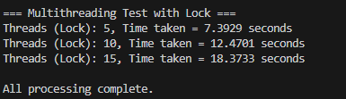
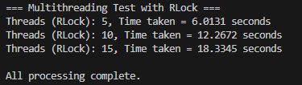
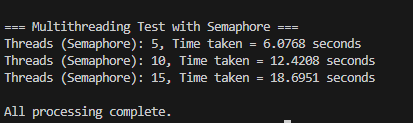

THREAD SYNCHRONIZATION

Overview: This project demonstrates thread synchronization in Python using three different mechanisms:

Lock
RLock
Semaphore
Each synchronization method is tested with multiple threads performing simulated tasks. The total time taken for all threads to complete is measured for performance comparison.

Observations:

RLock performed slightly faster overall compared to Lock and Semaphore.
The execution time increased roughly linearly as the number of threads increased.
Semaphore introduces more control over access limits, but can add minor overhead.
Lock ensures mutual exclusion but cannot be re-acquired by the same thread (unlike RLock).
Conclusion:

All synchronization mechanisms effectively prevent race conditions.
RLock provides a balance between flexibility and simplicity.
Semaphore is useful when you want to allow a limited number of threads to access a resource simultaneously.

