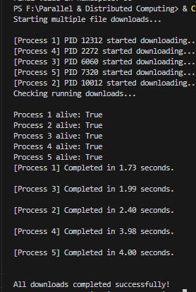

Namespace (Shared Data)
In multiprocessing, each process normally maintains separate memory. The Namespace object from multiprocessing.Manager() allows multiple processes to share and modify common data safely. It creates a shared memory-like environment where attributes can be accessed and updated across processes, enabling controlled communication between them.

Output(From the code):

NameSpace output:

Spawning Processes
Spawning a process means creating a new independent execution flow within a program. In Python, the multiprocessing.Process class allows the main program to run multiple tasks simultaneously by launching additional processes. Each spawned process has its own memory space and can execute code in parallel with the parent process.

Spawning output:

Killing Processes
A running process can be forcefully stopped using the terminate() method provided by the multiprocessing module. This is useful when a process becomes unresponsive or needs to be stopped due to a condition in the program. After terminating, process.join() ensures that system resources are properly released.

Killing process Output:

