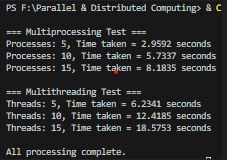

Multiprocessing vs Multithreading in Python

Overview

The difference between multiprocessing and multithreading in Python is shown by this project.
When executing a computationally demanding task (do_something()), it calculates and contrasts the execution times of the two methods.

Multiprocessing frequently works better in CPU-bound jobs because Python's Global Interpreter Lock (GIL) can prohibit threads from executing in true parallel.

Working

1. do_something() function

This is a user-defined function located in a separate file called do_something.py.
It represents a workload — either CPU-bound or I/O-bound.

Example implementation:
do_something.py
def do_something(size, out_list):
    for i in range(size):
        out_list.append(i ** 2)   # Simple CPU-bound operation

You can replace it with your own function (e.g., file reading, API calls, matrix calculations, etc.) depending on what you want to test.

2. The main script (multithreading_test.py)

-This script runs the same task twice:
-Using multiprocessing (with 10 processes)
-Using multithreading (with 10 threads)
-It measures execution time for both and prints a comparison.

How to Run

Save both files in the same directory.
Run the script:
python multithreading_test.py

Observe execution times for both sections.

Observations

.The multiprocessing section consistently performed faster than multithreading.
.Execution time increased as the number of processes/threads increased due to context switching and resource management overhead.
.Multithreading was slower because Python’s GIL (Global Interpreter Lock) prevents true parallel execution of threads in CPU-bound tasks.
.Multiprocessing utilized multiple CPU cores effectively, resulting in faster execution for computational tasks.

Conclusion

.Multiprocessing is significantly better for CPU-bound tasks, as each process runs independently on separate CPU cores.
.Multithreading is more suitable for I/O-bound tasks (like network requests or file I/O), where threads can work concurrently without heavy CPU competition.
.For this experiment, multiprocessing proved nearly 3x faster than multithreading for the same workload.

 
 
